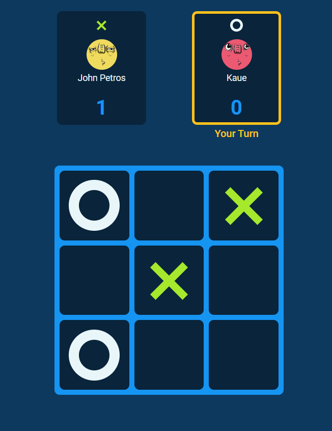

<h1 align="center">
    Tic Tac Toe Game #️⃣
</h1>

<div align="center">
   <a href="https://github.com/JohnPetros">
      
   </a>
   
   <a href="https://github.com/JohnPetros/tic-tac-toe-game/commits/main">
      
   </a>
  </a>
   </a>
   <a href="https://github.com/JohnPetros/tic-tac-toe-game/blob/main/LICENSE.md">
      
   </a>
    
</div>

<br>

## 🖥️ About the App

This app is a **Tic Tac Toe Game**, where two players alternate taking turns on an 3×3 board until one of them gets `x` or `o` in a whole row. This app was developed to practice the basics of TypeScript.

### ⏹️ Demonstration

<div align="center">
  
</div>

---

## ✨ Features

- [x] Set the game mode (whether single-player or multiplayer)
- [x] Set the difficulty (whether easy or hard) in case the mode is single-player
- [x] Set the name and symbol (whether `x` or `o`) of the players
- [x] Randomly set avatar of each player
- [x] Reset game settings at any moment of the game
- [x] Repeat or Reset the game at the end
- [x] Show who won the game (except in case of draw, obviously)
- [x] Increment score in case of winning
- [x] Display visual feedback indicating which player's turn it is
- [x] Display visual feedback (by a line-through) indicating which row has achieved the winning condition.

---

## 🛠️ Technologies

This app was developed using the following technologies:

- **[ReactJs](https://react.dev/)**

- **[TypeScript](https://www.typescriptlang.org/)**

- **[Framer Motion](https://www.framer.com/motion/)**

- **[Phosphor Icons](https://phosphoricons.com/)**

---

## 🚀 How to run this app?

### Prerequisites

You will need a package manager like [npm](https://www.npmjs.com/) or [yarn](https://yarnpkg.com/) to run the application.

#### 📟 Running the application

```bash

# Clone this repo
$ git clone https://github.com/JohnPetros/tic-tac-toe-game.git

# Access the app's folder
$ cd tic-tac-toe-game

# Install the dependecies
$ npm install or yarn add

# Run the app in development mode
$ npm run dev or yarn dev

# Probably the app will runnig on http://localhost:5173

```

---

## ⚙️ Deploy

This app was deployed by **[Vercel](https://vercel.com/home)**. This means you can access the running app by accessing this **[link](https://tic-tac-toe-game-pearl.vercel.app/)**.

---

## 💪 How to contribute

```bash

# Fork this repo
$ git clone https://github.com/JohnPetros/tic-tac-toe-game.git

# Create a branch with your feature
$ git checkout -b my-feature

# Commit your changes:
$ git commit -m 'feat: My new feature'

# Push to your branch:
$ git push origin my-feature

```

> You also can open a [new issue report](https://github.com/JohnPetros/tic-tac-toe-game/issues). It will be an honor to be able to help you and improve this application as well.

---

## 📝 License

This app is under MIT lincese. See the [License file](LICENSE) for more details.

---

<p align="center">
   Made with 💜 by John Petros 👋🏻
</p>
